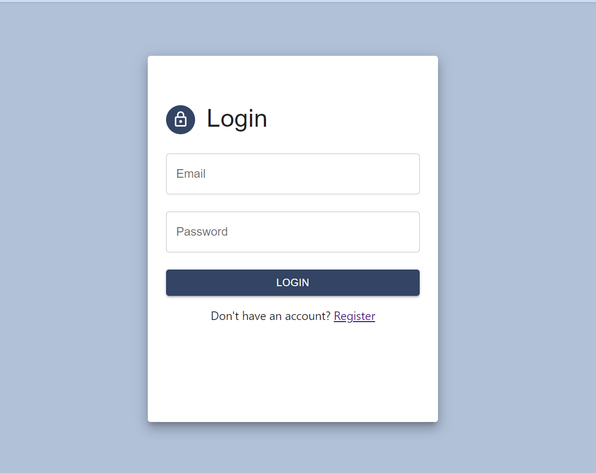
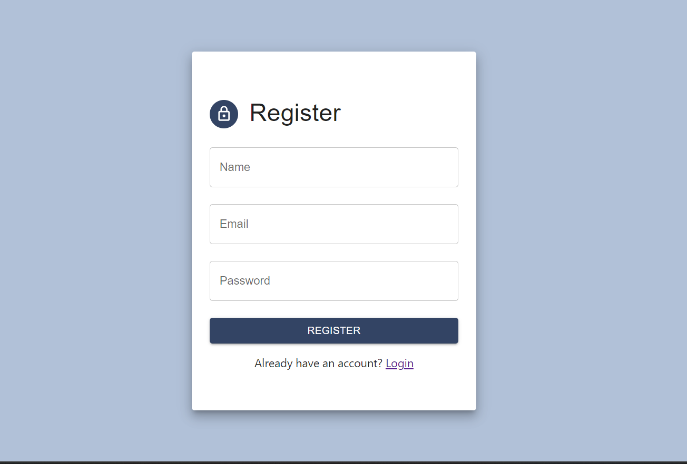
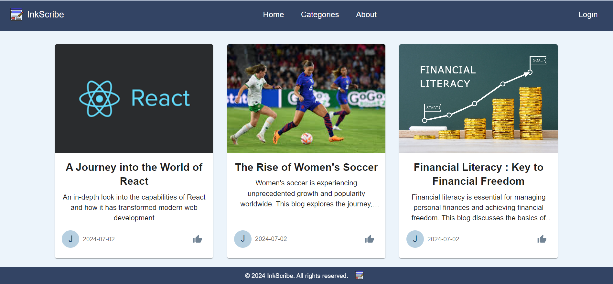
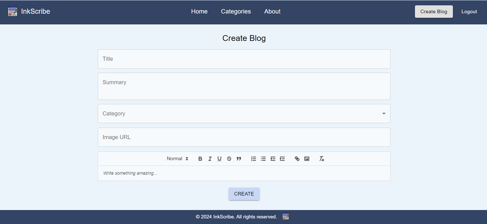
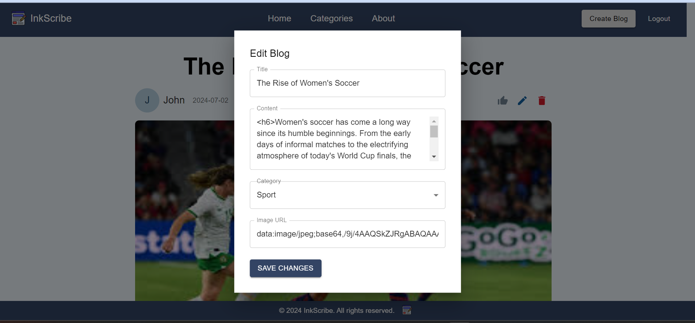

# InkScribe📝

InkScribe is a user-friendly blog platform built with MERN stack that allows anyone to explore a wide range of blog posts without any barriers. Users who wish to contribute their own blogs or manage their existing posts can do so by logging into the system.

## Features🎯

- **View Blogs**: All visitors can view blogs without logging in.
- **User Authentication**: Secure login and registration for users using Appwrite.
- **Add Blogs**: Let your creativity shine and share your content with the world.
- **Edit Blogs**: Modify your existing blogs to keep them up to date.
- **Delete Blogs**: Take down blogs you no longer wish to display.
- **Category-wise Filtering**: Browse blogs by categories to find content that interests you.
- **User-Specific Content Management**: Users can only manage (add, edit, delete) their own blog posts.

## Technologies💻

-**Frontend:**

- [ReactJs](https://react.dev/learn) - Enhances blog interactivity and responsiveness with its efficient UI rendering capabilities.

- [Material-UI](https://mui.com/material-ui/getting-started/) - Provides a sleek and consistent design for blog components, ensuring a polished user interface.

-**Backend:**

- [Node.js](https://nodejs.org/en) - Powers the backend of the blog platform, handling requests and enabling server-side logic.
- [Express](https://recoiljs.org/docs/introduction/getting-started) - Facilitates routing and middleware integration, supporting smooth API interactions and backend operations.
- [Mongoose](https://mongoosejs.com/) - Facilitates seamless interaction with MongoDB, providing schema-based modeling for blog data.

-**Database:**

- [MongoDB](https://www.mongodb.com/cloud/atlas/register) - Stores blog data in a flexible and scalable document-oriented database, ensuring efficient data management.

-**Authentication:**

- [Appwrite](https://appwrite.io/) - Enables secure user authentication for the blog platform.

## Login



## SignUp



## Home Page



## Create New Blog



## Edit Blog



## Installation🚀

### Backend

1. Clone the repository:

   ```sh
   git clone https://github.com/27-Sneha/InkScribe.git
   cd InkScribe
   ```

2. Navigate to the backend directory:

   ```sh
   cd backend
   ```

3. Install dependencies:

   ```sh
   npm install
   ```

4. Update MongoDB configuration:

   - Open `backend/connection.js` and modify the following :

     ```javascript
        mongodb+srv://<username>:<password>@<cluster>/<database>?retryWrites=true&w=majority&appName=<appname>
     ```

     Replace the following placeholders in your configuration files:

     - `<username>`: Your MongoDB username
     - `<password>`: Your MongoDB password
     - `<cluster>`: The MongoDB cluster URL
     - `<database>`: The MongoDB database name
     - `<appname>`: Optional. The name of your application

5. Start the backend server:
   ```sh
   npm start
   ```

### Frontend

1. Navigate to the frontend directory:

   ```sh
   cd frontend
   ```

2. Install dependencies:

   ```sh
   npm install
   ```

3. Update Appwrite configuration:

   - Open `frontend/src/utils/appwriteConfig.js` and modify the following constants:
     ```javascript
     export const API_ENDPOINT = "https://cloud.appwrite.io/v1";
     export const PROJECT_ID = "your_appwrite_project_id";
     ```
     Replace `your_appwrite_project_id` with your actual Appwrite project ID.

4. Start the frontend development server:

   ```sh
   npm start
   ```

5. Open your browser and navigate to `http://localhost:3000` to view the application.
